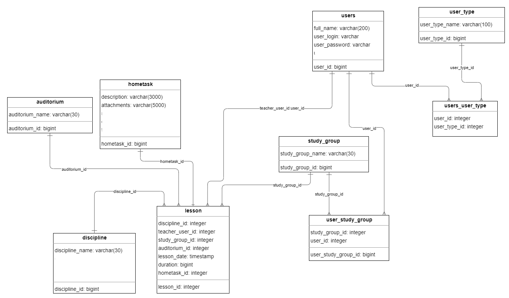

## Описание предметной области

Расписание занятий в учебном центре охватывает процессы создания, управления и хранения различных занятий. В данной предметной области используется база данных для эффективного хранения и управления занятиями.

1. **user (Пользователи)** : В системе присутствуют различные пользователи, такие как администраторы, преподаватели и обучающиеся. Администраторы могут создавать, редактировать и управлять занятиями. Преподаватели могут создавать, редактировать и управлять домашними заданиями. Обучающиеся могут просматривать расписание занятий с домашними заданиями.

2. **user_type (Роли пользователей)**: Роли определяют уровень доступа и полномочия пользователей в системе расписания занятий.
     
3. **hometask (Домашние задания)**: Преподаватель может задать домашнее задание, в котором будет указано само задание и дополнительные ссылки.
   
4. **discipline (Дисциплины)**: Занятия проводятся по дисциплинам.
   
5. **study_group (Учебные группы)**: Занятия проводятся для определенных учебных групп.
   
6. **auditorium (Аудитории)**: Занятия проводятся в определенных аудиториях.

7. **lesson (Занятия)**: Составление расписания занятий требует создание занятий, в которых указывается дисциплина, преподаватель, учебная группа, аудитория, дата проведения занятия, продолжительность занятия и домашнее задание.

## Проектирование БД
Процесс проектирования базы данных представляет собой последовательность переходов от словесного описания информационной структуры предметной области к
формализованному описанию объектов предметной области в терминах некоторой модели. В общем случае выделяют следующие этапы проектирования:
1. Анализ и описание предметной области информационной системы.
2. Концептуальное моделирование.
3. Построение логической модели
4. Построение физической модели

### Концептуальная модель
**Описание базы данных:**

1.  **Таблица "user_role"**
    
    *   `user_type_id` (bigint, PK) - уникальный идентификатор роли пользователя.
    *   `user_type_name` (varchar(100)) - название роли пользователя.
2.  **Таблица "user"**
    
    *   `user_id` (bigserial, PK) - уникальный идентификатор пользователя.
    *   `full_name` (varchar(200)) - полное имя пользователя.
    *   `user_login` (varchar) - логин пользователя.
    *   `user_password` (varchar) - пароль пользователя.
3.  **Таблица "users_user_type"**
    
    *   `user_id` (integer, FK) - внешний ключ, связанный с таблицей "user".
    *   `user_type_id` (integer, FK) - внешний ключ, связанный с таблицей "user_type".
  
3.  **Таблица "users_user_type"**
    
    *   `user_id` (integer, FK) - внешний ключ, связанный с таблицей "user".
    *   `study_group_id` (integer, FK) - внешний ключ, связанный с таблицей "study_group".

4.  **Таблица "hometask"**
    
    *   `hometask_id` (bigserial, PK) - уникальный идентификатор домашнего задания.
    *   `description` (varchar(500)) - описание домашнего задания.
    *   `attachments` (varchar(500)) - дополнительные ссылки.
  
5.  **Таблица "discipline"**
    
    *   `discipline_id` (bigserial, PK) - уникальный идентификатор дисциплины.
    *   `discipline_name` (varchar(500)) - название дисциплины.
  
6.  **Таблица "study_group"**
    
    *   `study_group_id` (bigserial, PK) - уникальный идентификатор учебной группы.
    *   `study_group_name` (varchar(500)) - название учебной группы.
  
7.  **Таблица "auditorium"**
    
    *   `auditorium_id` (bigserial, PK) - уникальный идентификатор аудитории.
    *   `auditorium_name` (varchar(500)) - название кабинета.

8.  **Таблица "lesson"**
    
    *   `lesson_id` (bigserial, PK) - уникальный идентификатор контракта.
    *   `date` (timestamp) - дата проведения занятия.
    *   `duration` (int) - продолжительность занятия.
    *   `teacher_user_id` (bigserial, FK) - внешний ключ, связанный с таблицей "users".
    *   `study_group_id` (bigserial, FK) - внешний ключ, связанный с таблицей "study_group".
    *   `auditorium_id` (bigserial, FK) - внешний ключ, связанный с таблицей "auditorium".
    *   `hometask_id` (bigserial, FK) - внешний ключ, связанный с таблицей "hometask".

**Связи между таблицами:**

*   Таблица "users_user_type" связывает таблицы "user" и "user_type" через внешние ключи `user_id` и `user_type_id`.
*   Таблица "user_study_group" связывает таблицы "user" и "study_group" через внешние ключи `user_id` и `study_group_id`.
*   Таблица "lessons" связана с таблицами "users" (через `teacher_user_id`), "discipline" (через `discipline_id)`), "study_group" (через `study_group_id`), "auditorium" (через `auditorium_id`), "hometask" (через `hometask_id`).
### Логическая модель базы данных

### Физическая модель Базы данных
Физическая модель и наполнение таблиц базы данных представлено в файле [CREATE_ALL.sql](CREATE_ALL.sql)
Запросы в файле [lab2.sql](lab2.sql)
